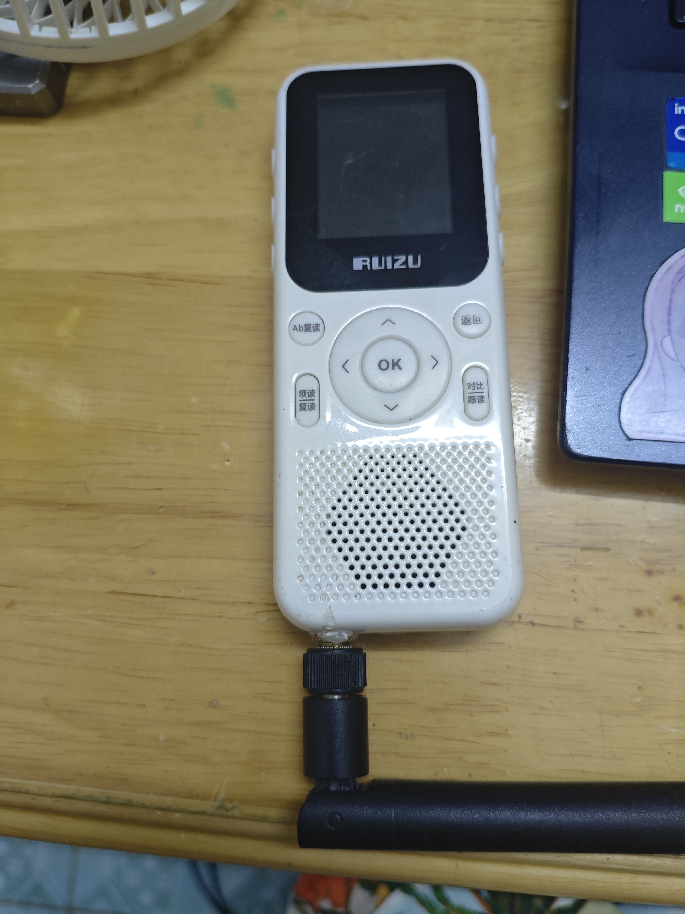
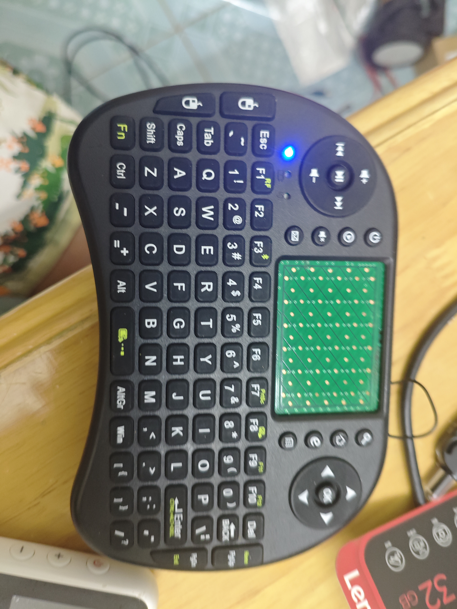

## 前言
在学校/家的时候，总要拿点电子设备来玩玩，以打发时间。然而，全国大部分学校和家庭（点名钦州市XX中学）对电子设备管控极其严格，甚至配备了安检门， 禁止带电子设备进入，并且，每周一的升旗仪式上还会拉几个带手机的出来批斗，这使得带电子产品入校十分危险，因此，我决定分享一些电子设备的生存指南。

## 我该带什么
**最好不要带手机！**，除非你人傻钱多还不在意处分。小型的电子设备通常是较好的选择，诸如MP3,MP4一类的物品极小，塞进夹层极难发现。

### MP3
这类东西的价格通常在15-30元之间，音质大多只能听个响，送的各种配件也垃圾  
推荐指数：2/5

320k以下的mp3文件还算能用，至于那些aac，flac一类的玩意，根本放不了；附带的tf卡通常是那种256MB扩容128G的假卡，及其不可靠，且只认FAT32格式。

### MP4
这玩意价格从40到1000的都有，功能也分为两种，一种非安卓的，一种安卓的。  
推荐指数：4/5
非安卓的那种就比较简单了，功能很少，除了价格便宜没啥优点，音质比上面的MP3好点，解析方面和MP3大差不差。    
安卓款价格稍高，最少也要100多元，玩法更多样，甚至能玩小游戏.  
以我手上的锐族V05为例，是我从亲戚那里拿来的，MT6572，512MB+4GB，安卓4.4，屏幕小到离谱，但是可以任意安装软件，可玩性极强，甚至能刷机，音质也比前面两个好。  
  
（下面的天线是拿来蹭网的）  
因为性能极差，装的软件基本是精简版（比如QQ手表版），稍微大点的玩意都运行不了，再加上这机子屏幕很小，电池也只有1000毫安，上网的话一个上午都撑不了，只听歌的话能玩一个星期。  
以及，MP4是虚假宣传的多发产品，市面上那些几十块钱“HIFI音质”的99%是假的，真的HIFI播放器跟个手机一样，价格也贵到离谱，没必要买这个，我这个小玩意也够用了，现在能玩点小游戏，看QQ等。

### 充电宝
推荐指数：5/5  
危险指数：看牌子  
住校生极其需要这个玩意来给电子设备补能，市面上这玩意卖啥价格的都有，质量参差不齐，**像那种10块钱2万毫安的绝对是假的，还有一堆虚假产品，千万不要买，毕竟会炸**  
我用的是一个1万毫安的充电宝，不能快充，不过给那些小东西充电够了。  
**以及，一定要买带3C的正规牌子，不然你拿的就是移动炸弹了。**

### 小键盘
推荐指数：3/5
这玩意不贵，十几块钱，有锂电和电池两种，推荐电池的，因为随处可见，在晚自习对答案，以及电教委员日常维护一体机的时候都很方便，而且连接距离极其离谱，在教室最后一排都能连上，就是延迟很大，而且打字手感犹如大号遥控器，打字不太舒服。  
  

### 放哪里
对我校而言，只需要准备一个挎包，放里面，然后走过那个马奇诺防线般的安检门，再从左边保安旁边穿过去即可躲开检查。  
我**非常不推荐**把电子设备即存在外面的店铺，一是数据安全可能受到威胁，二是可能被偷，三是需要支付一定的费用。  
带进学校后，胆子大的可以直接放抽屉里，但要小心某些“少陵野老”来抽屉偷玩，也可以放在包里，一般没人会去翻，除非你的同学很贱。  
亦或者，你可以找本字典，挖个洞，把设备放进去，或者把你的设备藏到一个你自己知道的地方。